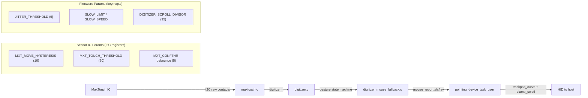

# Fix Sofle Procyon Trackpad Issues

## Problem Analysis

The "jumps at slow speed" issue is caused by a **stick-then-jump effect** from two interacting layers:

1. **Sensor-level hysteresis** (`MXT_MOVE_HYSTERESIS_NEXT = 16` in [procyon.h](drivers/sensors/procyon.h)) -- the MaxTouch IC holds reported position until accumulated movement exceeds 16 units, then releases a large delta all at once
2. **Firmware-level jitter filter** (`TRACKPAD_JITTER_THRESHOLD = 5` in [keymap.c](keymaps/vial/keymap.c)) -- drops small deltas, but the sensor's hysteresis means deltas arrive as infrequent larger "bursts" rather than smooth small increments

The combination means slow finger movements produce: nothing... nothing... nothing... **jump** -- instead of smooth gradual motion.

## Architecture Overview




**Where changes go:**

- **[sofle_procyon/config.h](config.h)** -- sensor parameter overrides (preferred, no vial-qmk changes)
- **[sofle_procyon/keymaps/vial/keymap.c](keymaps/vial/keymap.c)** -- acceleration curve, smoothing filter, runtime keycodes
- **[sofle_procyon/rules.mk](rules.mk)** -- enable MAXTOUCH_DEBUG for tuning builds
- **vial-qmk** -- no changes needed (all sensor params are overridable via `#define` from sofle_procyon)

## Phase 1: Fix Slow-Speed Jumping (Default Tuning)

All changes in **sofle_procyon** only.

### 1a. Lower sensor-side movement hysteresis

In [config.h](config.h), override the Procyon defaults that cause stick-then-jump:

```c
// Override procyon.h defaults for smoother low-speed tracking
#define MXT_MOVE_HYSTERESIS_INITIAL 3   // was 10 (from maxtouch.c default)
#define MXT_MOVE_HYSTERESIS_NEXT    4   // was 16 (from procyon.h)
```

These are checked with `#ifndef` in both `maxtouch.c` and `procyon.h`, so overrides from `config.h` take priority with no vial-qmk changes.

### 1b. Lift-off cursor jump suppression (1-frame buffering)

The biggest trackpad annoyance: when you lift your finger, the cursor jumps. This happens because the finger's contact area shifts as it peels off the sensor surface, and the MaxTouch IC reports that shift as a `MXT_MOVE` event **before** the `MXT_UP` event.

**Fix:** Add a 1-frame buffer in `pointing_device_task_user()`:

```c
// Pseudocode for lift-off suppression
static mouse_xy_report_t prev_x, prev_y;
static bool              have_prev = false;
static uint8_t           zero_frames = 0;

// If current frame has zero movement, finger may have just lifted
if (mouse_report.x == 0 && mouse_report.y == 0) {
    zero_frames++;
    if (zero_frames == 1 && have_prev) {
        // Suppress the buffered frame -- it was the lift-off spike
        prev_x = prev_y = 0;
    }
} else {
    zero_frames = 0;
}

// Send the PREVIOUS frame's data (1-frame delay)
mouse_xy_report_t out_x = prev_x;
mouse_xy_report_t out_y = prev_y;
prev_x = trackpad_curve(mouse_report.x);
prev_y = trackpad_curve(mouse_report.y);
have_prev = true;
mouse_report.x = out_x;
mouse_report.y = out_y;
```

At ~300Hz scan rate, the 1-frame delay adds ~3ms of latency -- completely imperceptible. The filter only activates at the exact moment of lift-off (movement followed by zero movement), so it doesn't affect normal tracking at all.

### 1c. Replace binary jitter filter with exponential moving average (EMA)

In [keymaps/vial/keymap.c](keymaps/vial/keymap.c), replace `trackpad_curve()` with a smoother approach:

- Remove the hard `TRACKPAD_JITTER_THRESHOLD` cutoff (drops all deltas <= 5, causing perceptible dead zone)
- Add a lightweight EMA filter that smooths small movements instead of dropping them
- Keep the two-zone acceleration (slow precision / fast acceleration) but make the transition gradual
- This directly addresses the "not smooth or precise at slow speed" complaint

### 1d. Improve scroll feel

- Review `DIGITIZER_SCROLL_DIVISOR` (currently 35) -- may need slight adjustment
- Consider adding momentum/inertia to scroll for smoother two-finger scrolling
- Potentially lower `SCROLL_MAX_PER_REPORT` from 2 to 1 for fine-grained scroll if needed

### 1e. Improve tap detection

- Tune `DIGITIZER_MOUSE_TAP_DETECTION_TIMEOUT` (default 200ms in vial-qmk) -- can override in config.h
- Review `DIGITIZER_MOUSE_TAP_DISTANCE` (currently 50, raised from default 25) -- verify this is appropriate
- Consider enabling `DIGITIZER_REPORT_TAPS_AS_CLICKS` if tap reliability is still an issue

## Phase 2: Runtime Parameter Adjustment

Add custom keycodes in [keymaps/vial/keymap.c](keymaps/vial/keymap.c) so cursor speed, scroll sensitivity, and key tuning values can be changed on-the-fly without reflashing.

### 2a. Add custom keycodes

Using QMK's `SAFE_RANGE` custom keycode mechanism:

- `**CPI_UP` / `CPI_DN**` -- adjust cursor speed (modify the acceleration curve multipliers)
- `**SCR_UP` / `SCR_DN**` -- adjust scroll sensitivity (modify effective scroll divisor)
- `**TP_RST**` -- reset all parameters to defaults

### 2b. EEPROM persistence

- Store tuning parameters in EEPROM via `eeconfig_update_user()` / `eeconfig_read_user()`
- Values survive power cycles and don't require reflashing
- `TP_RST` keycode resets to compiled defaults

### 2c. Update VIAL definition

- Add the custom keycodes to [keymaps/vial/vial.json](keymaps/vial/vial.json) so they appear in the VIAL GUI
- Map some to default layer positions (e.g., on ADJUST layer)

## Phase 3: MaxTouch Debug Workflow (Documentation)

### 3a. Enable MAXTOUCH_DEBUG as a build option

Document how to build with `MAXTOUCH_DEBUG = yes` in [rules.mk](rules.mk) for tuning sessions. This enables the raw HID interface that the [maxtouch-debug](https://github.com/george-norton/maxtouch-debug) tool uses to read/write any MaxTouch register in real-time.

**Workflow:**

1. Build with `MAXTOUCH_DEBUG = yes`, flash
2. Run maxtouch-debug tool, adjust sensor params (threshold, gain, hysteresis) live
3. Note optimal values
4. Update `#define` overrides in `config.h`
5. Rebuild without debug, flash final firmware

### 3b. Update readme.md

- Document the runtime keycodes (CPI_UP/DN, SCR_UP/DN, TP_RST)
- Document the MAXTOUCH_DEBUG tuning workflow
- Add the vial-qmk fork context (merged george-norton/multitouch_experiment into vial-procyon branch)
- Reference the [Dilemma features doc](https://docs.bastardkb.com/fw/dilemma-features.html#trackpad-related-features) and [Procyon repo](https://github.com/george-norton/procyon) for context

## Key Decisions

- **All changes in sofle_procyon repo** -- no vial-qmk modifications needed because all sensor parameters use `#ifndef` guards and can be overridden from the keyboard's config.h
- **EMA smoothing in firmware** rather than increasing sensor-side smoothing (`movsmooth`/`movfilter`) -- gives us more control and is adjustable at runtime
- **EEPROM for persistence** -- standard QMK pattern, no custom protocol needed
- **MAXTOUCH_DEBUG left as opt-in** -- it uses raw HID which conflicts with VIAL's raw HID, so it should only be enabled for dedicated tuning sessions

